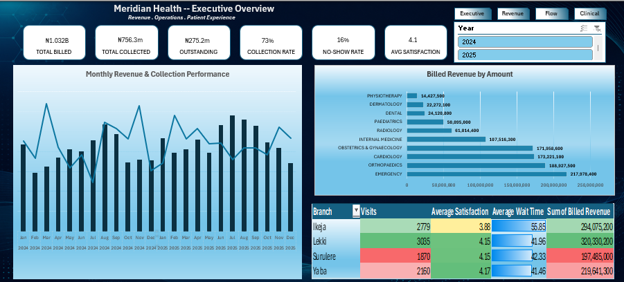
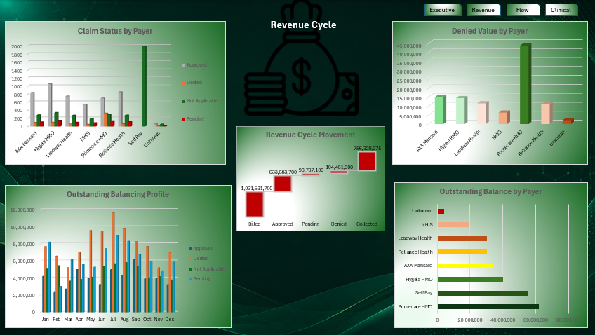
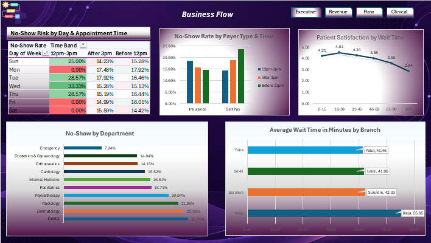
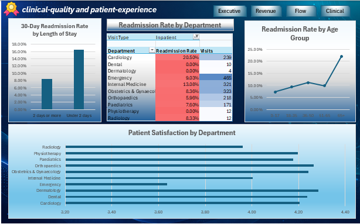

# Meridian Health Analytics

## Healthcare Operations, Revenue Cycle & Patient Experience Analysis


> **An end-to-end Excel + Power Query analytics project that turns a
> messy hospital encounter export into a validated analytical dataset,
> decision-focused analysis, and four interactive dashboards.**

------------------------------------------------------------------------

## 📌 Project at a Glance

**Meridian Health Analytics** is a fictional healthcare analytics
project built around hospital encounter data covering **January 2024 to
December 2025**.

The project was designed to answer five practical business questions:

1.  **How much billed revenue is actually collected?**
2.  **How much appointment capacity is lost through no-shows and
    cancellations?**
3.  **Which payer is contributing most to denied claims?**
4.  **Does waiting time affect patient satisfaction?**
5.  **Which inpatient groups have higher 30-day readmission rates?**

The workflow was intentionally built like a real analytics assignment:

**Raw Export → Data Quality → Power Query Cleaning →
Standardization/Mapping → Analytical Dataset → PivotTables & KPIs →
Dashboards → Business Recommendations**

# 🖼️ Dashboard Preview

Add the screenshots to an `assets/` folder in this repository.

### Executive Dashboard



### Revenue Dashboard



### Patient Flow Dashboard



### Clinical Dashboard



------------------------------------------------------------------------

------------------------------------------------------------------------

## 🎯 Executive Summary

The analysis found that Meridian's main challenges are not simply about
generating revenue or seeing more patients. The larger opportunities are
in **revenue collection, payer denials, appointment attendance, patient
waiting time, and readmission risk**.

### Headline findings

  Finding                                Result
  ------------------------------ --------------
  Final analytical encounters         **9,844**
  Total billed revenue              **₦1.03bn**
  Total collected                   **₦756.3m**
  Outstanding balance               **₦275.2m**
  Collection rate                     **73.3%**
  No-show rate                        **16.3%**
  Claim denial rate                   **11.2%**
  Denied claim value                **₦104.5m**
  Average wait time                **45.9 min**
  Average satisfaction              **4.1 / 5**
  30-day inpatient readmission        **10.5%**

### What the numbers suggest

-   **Revenue grew, but collection efficiency did not improve
    materially.** Billed revenue increased from approximately **₦477.8m
    in 2024 to ₦553.7m in 2025**, while collection stayed around 73.3%.
-   **PrimeCare HMO is a major denial-risk area**, with a **28.0% denial
    rate** and approximately **₦43.8m** in denied billed value.
-   **No-shows are concentrated in identifiable segments**, creating an
    opportunity for targeted confirmation and reminder strategies rather
    than a one-size-fits-all approach.
-   **Longer waits are associated with lower satisfaction.**
    Satisfaction falls to **3.98** at 46--60 minutes, **3.55** at 61--90
    minutes, and **2.84** above 90 minutes.
-   **Ikeja is the waiting-time outlier**, at approximately **55.8
    minutes** compared with roughly 41--42 minutes at the other
    branches.
-   **Short inpatient stays show higher readmission risk**, with
    approximately **16.6%** readmission for stays under two days versus
    **8.4%** for stays of two days or more.

------------------------------------------------------------------------

# 🔎 Key Findings & Business Interpretation

## 1. Revenue increased, but the collection rate remained around 73%

Billed revenue increased from approximately **₦477.8m in 2024** to
**₦553.7m in 2025**.

However, the collection rate remained approximately **73.3%** across
both years.

That leaves approximately **₦275.2m outstanding**.

### Interpretation

The hospital is generating more billed activity, but the improvement is
not translating into a higher proportion of cash collected.

**Business question raised:** What is preventing billed revenue from
converting into collected revenue?

------------------------------------------------------------------------

## 2. PrimeCare HMO is the clearest payer-denial problem

PrimeCare HMO has a **28.0% denial rate**, materially higher than the
peer pattern in the analysis.

The workbook shows approximately:

-   **₦43.8m** denied billed value
-   **₦61.9m** outstanding balance for PrimeCare

### Interpretation

This points toward a payer-specific investigation into:

-   claims documentation
-   authorization requirements
-   eligibility/coverage checks
-   coding or submission issues
-   reconciliation of denied and outstanding claims

The recommendation is therefore not simply "reduce denials," but
**identify why PrimeCare claims are being denied and address the
specific failure points.**

------------------------------------------------------------------------

## 3. No-shows represent an operational capacity problem

Overall no-show rate is **16.3%**.

The analysis identifies differences by:

-   time band
-   payer type
-   department
-   day of week

Higher-risk periods and segments can therefore be targeted with
appointment confirmation and reminder workflows.

### Interpretation

Instead of applying the same reminder strategy to every patient,
Meridian could use the analysis to prioritize the combinations of
**time + payer + department** where no-show behaviour is higher.

------------------------------------------------------------------------

## 4. Waiting time and satisfaction move in opposite directions

Average wait time is **45.9 minutes**.

  Wait band      Satisfaction
  ------------ --------------
  0--15 min              4.21
  16--30 min             4.51
  31--45 min             4.24
  46--60 min             3.98
  61--90 min             3.55
  90+ min                2.84

The sharpest deterioration occurs in the longer waiting bands.

Ikeja also stands out at approximately **55.8 minutes** average wait
compared with roughly 41--42 minutes at the other branches.

### Interpretation

Waiting time is not only an operational metric. It is also a
patient-experience signal.

------------------------------------------------------------------------

## 5. Short inpatient stays show higher readmission risk

Overall inpatient 30-day readmission is **10.5%**.

The workbook shows approximately:

-   **Under 2 days:** 16.6%
-   **2 days or more:** 8.4%
-   **Cardiology:** 20.5% across 239 inpatient visits
-   **Age 65+:** approximately 22.0%

### Interpretation

The analysis supports closer review of discharge planning, follow-up and
post-discharge monitoring for higher-risk groups.

------------------------------------------------------------------------

# 💡 Recommendations

### 1. Prioritize PrimeCare claims review

Create a payer-specific denial review covering authorization,
documentation, eligibility and submission issues.

### 2. Target no-show interventions

Use the department, payer and time-band analysis to focus confirmation
calls/messages where no-show risk is highest.

### 3. Investigate the Ikeja wait-time outlier

Review staffing, appointment scheduling, patient arrival patterns and
service bottlenecks contributing to longer waits.

### 4. Strengthen follow-up for higher-risk inpatient groups

Review discharge and post-discharge pathways for short-stay patients,
Cardiology and older patients.

### 5. Track collection against an 82% target

Use the monthly collection-rate trend to make the gap between current
performance and the target visible to decision-makers.

------------------------------------------------------------------------

# 🧹 Data Cleaning & Power Query

The project deliberately starts with data quality rather than jumping
straight into visualization.

### Cleaning results

-   Raw export: **10,624 rows**
-   After removing fully blank rows: **10,610**
-   After normalized encounter deduplication: **10,000**
-   After excluding records with missing Visit Date: **9,844 analytical
    encounters**
-   Final cleaned dataset: **41 columns**

### Major Power Query steps

-   Normalize encounter identifiers
-   Remove duplicate encounters using a normalized key
-   Standardize categorical fields using controlled mapping tables
-   Validate mapping match counts before expanding merged tables
-   Clean invalid ages, dates, wait times and financial values
-   Convert data types explicitly
-   Create analytical fields for time, wait, age, payer and
    length-of-stay analysis
-   Create a final clean query (`qEncounters`) for the analytical
    dataset

### Representative Power Query / M logic

These are examples of the transformation logic used in the project.

**1. Normalize an identifier**

``` powerquery
if [Raw] = null then ""
else Text.Lower(
    Text.Trim(
        Text.Replace(
            Text.From([Raw]),
            Character.FromNumber(160),
            " "
        )
    )
)
```

This removes inconsistent casing, trims whitespace and handles
non-breaking spaces before matching.

**2. Create an attendance flag**

``` powerquery
if [Attendance Status] = "Attended" then 1 else 0
```

**3. Create a time-based analytical field**

``` powerquery
if [Appointment Hour] < 12 then "Before 12pm"
else if [Appointment Hour] <= 15 then "12pm–3pm"
else "After 3pm"
```

**4. Create length of stay**

``` powerquery
if [Admission Date] <> null and [Discharge Date] <> null
then Duration.Days([Discharge Date] - [Admission Date])
else null
```

> These snippets illustrate the type of M logic used. The workbook
> contains the complete Power Query workflow and mapping queries.

------------------------------------------------------------------------

# 📊 Dashboard Structure

## Executive Dashboard --- `DASH_EXEC`

Designed for a quick management-level view.

Includes:

-   Total billed revenue
-   Total collected
-   Outstanding balance
-   Collection rate
-   No-show rate
-   Average satisfaction
-   Monthly revenue/collection trend
-   Revenue by department
-   Branch performance

## Revenue Dashboard --- `DASH_REVENUE`

Focuses on revenue-cycle performance.

Includes:

-   Denial rate by payer
-   Denied value by payer
-   Revenue-cycle movement
-   Collection-rate trend
-   82% collection target
-   Outstanding balance by payer
-   Claim-status/ageing analysis

## Patient Flow Dashboard --- `DASH_FLOW`

Focuses on operational capacity and patient experience.

Includes:

-   No-show patterns by day/time
-   No-show by department
-   No-show by payer type and time
-   Wait-time versus satisfaction
-   45-minute threshold context
-   Branch wait-time comparison

## Clinical Dashboard --- `DASH_CLINICAL`

Focuses on inpatient outcomes and patient experience.

Includes:

-   Readmission by length-of-stay band
-   Readmission by department
-   Readmission by age band
-   Satisfaction by department
-   Doctor workload, wait and satisfaction
-   Length-of-stay distribution

------------------------------------------------------------------------

# 🛠️ Tools & Skills Demonstrated

### Tools

-   **Microsoft Excel**
-   **Power Query / M**
-   **PivotTables**
-   **Excel formulas**
-   **Power Pivot / Data Model exploration**
-   **Excel dashboard design**

### Skills

-   Data cleaning and transformation
-   Data-quality validation
-   Identifier normalization
-   Deduplication
-   Lookup/mapping logic
-   KPI development
-   Conditional analysis
-   Trend analysis
-   Revenue-cycle analytics
-   Healthcare operations analytics
-   Patient-experience analytics
-   Clinical outcome analysis
-   Dashboard storytelling
-   Business recommendations

------------------------------------------------------------------------

# 🗂️ Workbook Structure

  Sheet                     Purpose
  ------------------------- -----------------------------------
  `Project Documentation`   Project context and documentation
  `DASH_EXEC`               Executive dashboard
  `DASH_REVENUE`            Revenue-cycle dashboard
  `DASH_FLOW`               Patient-flow dashboard
  `DASH_CLINICAL`           Clinical dashboard
  `DQ_Report`               Data-quality checks
  `Pivot Tables`            Supporting analysis
  `Mapping Tables`          Standardization reference tables
  `Data_Clean`              Final cleaned analytical dataset
  `Raw_Export`              Original raw export

------------------------------------------------------------------------


# 📁 Repository Files

``` text
Meridian-Health-Analytics/
│
├── Meridian_Health_Analytics.xlsx
├── README.md
├── assets/
│   ├── dashboard-exec.png
│   ├── dashboard-revenue.png
│   ├── dashboard-flow.png
│   └── dashboard-clinical.png
└── documentation/
    └── Meridian_Health_Project_Documentation.docx
```

------------------------------------------------------------------------

# 📌 Dataset Note

The hospital dataset is **fictional/synthetic** and is used for
portfolio and learning purposes.

No real patient information should be included in the public repository.

------------------------------------------------------------------------

# ⚠️ Metric Definition Note

The workbook contains a `Revenue-at-Risk` KPI calculated from no-show
volume multiplied by average billed revenue per attended encounter.

This should be described publicly as a **theoretical billed-value
estimate associated with no-show volume**, not guaranteed recoverable
revenue.


------------------------------------------------------------------------

## 🔗 Connect

If you found the project useful or have suggestions for improving the
analysis, feel free to connect with me on LinkedIn or explore the
repository.
